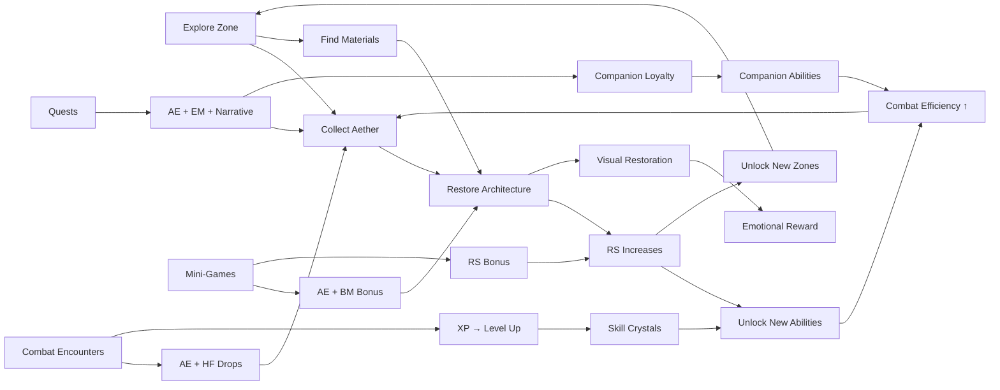

# TARTARIA WORLD OF WONDER — Economy & Balance Design
## Resource Systems, Crafting, Reward Curves & Progression Tuning

---

> *The economy exists to serve wonder, not to extract payment. If a player ever feels punished for not spending, the design has failed.*

**Cross-References:**
- [08_MONETIZATION.md](08_MONETIZATION.md) — Revenue model, IAP structure, anti-pay-to-win guardrails
- [06_COMBAT_PROGRESSION.md](06_COMBAT_PROGRESSION.md) — Combat rewards, skill progression
- [00_MASTER_GDD.md](00_MASTER_GDD.md) — Core loop, pillar definitions
- [03C_MOON_MECHANICS_DETAILED.md](03C_MOON_MECHANICS_DETAILED.md) — Moon-specific mechanics and rewards
- [10_ROADMAP.md](10_ROADMAP.md) — Development phase milestones
- [15_MVP_BUILD_SPEC.md](15_MVP_BUILD_SPEC.md) — Aether 3-band model implementation
- [16_PLAYTHROUGH_PROTOTYPES.md](16_PLAYTHROUGH_PROTOTYPES.md) — Economy stress test prototype

---

## Table of Contents

1. [Economy Design Philosophy](#1-economy-design-philosophy)
2. [Resource Taxonomy](#2-resource-taxonomy)
3. [Aether — The Core Resource](#3-aether-the-core-resource)
4. [Building Materials](#4-building-materials)
5. [Resonance Score (RS) Economy](#5-resonance-score-rs-economy)
6. [Skill Crystals & Progression](#6-skill-crystals-progression)
7. [Crafting System](#7-crafting-system)
8. [Reward Curves](#8-reward-curves)
9. [Session Pacing & Resource Flow](#9-session-pacing-resource-flow)
10. [Moon-by-Moon Progression Targets](#10-moon-by-moon-progression-targets)
11. [Premium Currency (Resonance Crystals)](#11-premium-currency-resonance-crystals)
12. [Anti-Inflation Sinks](#12-anti-inflation-sinks)
13. [Balance Testing Framework](#13-balance-testing-framework)
14. [Tuning Levers](#14-tuning-levers)
15. [Cross-Document Reconciliation Checklist](#15-cross-document-reconciliation-checklist)

---

## 1. Economy Design Philosophy

### Core Rules

| Rule | Rationale |
|---|---|
| **Never bottleneck core progression** | Free players must always have enough resources to advance the main storyline |
| **Reward mastery, not grinding** | Higher-quality play (RS, combat accuracy, tuning precision) earns more, not more time spent |
| **Visible value** | Players should always see what they're earning, why, and what it leads to |
| **Generous defaults** | Err on the side of too much, then tune downward. Stinginess kills wonder. |
| **No hidden drains** | Every resource expenditure is surfaced with clear cost before the action |
| **Parallel tracks** | Multiple resource types prevent any single bottleneck from blocking all progress |

### The "One More" Principle

Every 15-minute session should end with the player having:
- Enough resources to start one more building (invitation to next session)
- Just finished something satisfying (sense of progress)
- Visibility into what the next major milestone requires (anticipation)

---

## 2. Resource Taxonomy

### Primary Resources

| Resource | Icon | Earned From | Spent On | Storage |
|---|---|---|---|---|
| **Aether (AE)** | Golden swirl | Excavation, tuning, restoration, ley-line harvest | Building construction, ability use, upgrades | Per-zone reservoir + personal reserve |
| **Building Materials (BM)** | Stone block | Excavation, quarrying, combat drops | Building placement, structural upgrades | Inventory (stackable) |
| **Skill Crystals (SC)** | Crystal star | Level-up, Moon-end climax bonus, achievements, discoveries | Skill tree nodes | Cumulative (never lost) |
| **Resonance Score (RS)** | Golden wave | Building quality, zone restoration | Unlocks (enemies, features, zones), global progress | Per-zone + planetary aggregate |

### Secondary Resources

| Resource | Icon | Earned From | Spent On | Notes |
|---|---|---|---|---|
| **Harmonic Fragments (HF)** | Musical note | Combat, tuning excellence, rare drops | Crafting, ability enhancement | Crafting currency |
| **Echo Memories (EM)** | Spectral orb | NPC interactions, lore discovery | Companion upgrades, codex entries | Knowledge currency |
| **Crystalline Dust (CD)** | Sparkle | Crystal zone harvesting (Moon 2+) | High-tier crafting, gem socketing | Rare material |
| **Forge Tokens (FT)** | Anvil | Deep Forge activities (Moon 10+) | Endgame crafting, alloy weapons | Late-game material |

### Premium Resource

| Resource | Icon | Earned (Free) | Earned (Paid) | Spent On |
|---|---|---|---|---|
| **Resonance Crystals (RC)** | Prism | 5/day login + 10/Moon climax + achievements | IAP ($0.99–$49.99 packs) | Cosmetics only (zero gameplay) |

---

## 3. Aether — The Core Resource

### The 3-Band Model

Aether is the lifeblood of the game. It flows through three bands (see [15_MVP_BUILD_SPEC.md](15_MVP_BUILD_SPEC.md)):

| Band | Frequency | Source | Use | Visual |
|---|---|---|---|---|
| **Low Band (Telluric)** | 7.83–32 Hz | Ground excavation, deep scanning | Foundation construction, heavy structures | Red-amber particles |
| **Mid Band (Harmonic)** | 174–528 Hz | Tuning, restoration, ley-line flow | General construction, ability power | Golden particles |
| **High Band (Celestial)** | 963–2048 Hz | Climax events, aurora harvesting | Advanced upgrades, celestial structures | White-gold particles |

### Earn Rates

| Activity | AE per Minute | Band | Conditions |
|---|---|---|---|
| Mud excavation (basic) | 8–12 | Low | Default dig speed |
| Architecture reveal | 20 (burst) | Low + Mid | One-time on first reveal |
| Tuning (3-node) | 15–25 | Mid | Based on accuracy (60–100%) |
| Dome restoration | 50 (burst) | All bands | One-time per dome |
| Ley-line harvest (passive) | 3–5 | Mid | Requires restored ley-line |
| Combat victory | 10–15 | Mid + High | Per enemy defeated |
| Moon-end climax | 200 (burst) | All bands | One-time per Moon |
| Giant-mode quarrying | 15–20 | Low | Moon 4+ |
| Fountain network | 5–8 (passive) | Mid + High | Moon 12+ regional bonus |

### Spend Rates

| Action | AE Cost | Band Required | Notes |
|---|---|---|---|
| Small building (dome, hut) | 60–80 | Low | Tier 1 structure |
| Medium building (spire, workshop) | 120–180 | Low + Mid | Tier 2 structure |
| Large building (cathedral, fortress) | 300–500 | All bands | Tier 3 structure |
| Structural upgrade (Tier 1→2) | 100 | Mid | Per-building |
| Structural upgrade (Tier 2→3) | 250 | Mid + High | Per-building |
| Resonance ability (per use) | 10–30 | Mid | Scales with ability level |
| Giant-mode activation | 40 | Low | 2-minute duration |
| Advanced scan overlay | 15 | High | 30-second duration |

### Balance Target

A 15-minute session of mixed gameplay should yield **80–120 AE** and spend **60–100 AE**, leaving the player with a net positive reserve that encourages the next session.

**Reserve Health Check:**
- Healthy: 1–2 sessions of AE buffered (100–250 AE)
- Starved (FAIL): 0 AE, unable to build without grinding → tuning lever needed
- Flooded (WATCH): >500 AE, nothing meaningful to spend on → need new sinks or content

---

## 4. Building Materials

### Material Tiers

| Tier | Material | Source | Unlock Moon | Used For |
|---|---|---|---|---|
| 1 | **Mud Brick** | Excavation (basic) | 1 | Foundations, simple structures |
| 2 | **Cut Stone** | Quarrying (giant mode) | 4 | Walls, arches, buttresses |
| 3 | **Resonant Crystal** | Crystal zone harvest | 2 | Amplifiers, windows, accents |
| 4 | **Living Wood** | Canopy harvest | 8 | Organic structures, vine bridges |
| 5 | **Forged Alloy** | Deep Forge craft | 10 | Reinforcements, advanced machinery |
| 6 | **Celestial Glass** | Observatory craft | 12 | Observatory domes, lenses, spire caps |
| 7 | **Tartarian Composite** | Endgame craft (all materials) | 13 | Masterwork structures |

### Earn Rates

| Material | Per Excavation/Harvest | Per Session (15 min) | Notes |
|---|---|---|---|
| Mud Brick | 2–3 | 8–15 | Abundant, never scarce |
| Cut Stone | 1–2 | 5–10 | Requires giant mode |
| Resonant Crystal | 1 | 3–5 | Zone-specific |
| Living Wood | 1–2 | 4–8 | Zone-specific |
| Forged Alloy | 1 | 2–4 | Requires forging mini-game |
| Celestial Glass | 1 | 1–3 | Rarest harvested material |
| Tartarian Composite | 0 (crafted) | 1–2 | Requires all lower tiers |

### Build Costs

| Structure Type | Mud Brick | Cut Stone | Crystal | Wood | Alloy | Glass | Composite |
|---|---|---|---|---|---|---|---|
| Simple Dome | 5 | — | — | — | — | — | — |
| Reinforced Dome | 3 | 3 | — | — | — | — | — |
| Crystal Spire | — | 2 | 4 | — | — | — | — |
| Living Bridge | — | — | — | 6 | — | — | — |
| Forged Gate | — | 3 | — | — | 4 | — | — |
| Observatory Wing | — | 2 | 3 | — | 2 | 3 | — |
| Masterwork Cathedral | 5 | 5 | 3 | 3 | 3 | 2 | 2 |

---

## 5. Resonance Score (RS) Economy

### What RS Represents

RS is not a resource the player spends — it's a quality metric that grows through good play. Think of it as the world's "health score."

### Per-Zone RS

Each zone has its own RS (0–100):

| RS Range | Zone State | Effects |
|---|---|---|
| 0–10 | Heavily corrupted | No NPCs, corruption enemies, muted visuals |
| 11–30 | Partially restored | Basic NPCs appear, some color returns |
| 31–50 | Functional | Full NPC activity, combat balanced, shops open |
| 51–70 | Thriving | Bonus Aether generation, advanced NPCs, visual flourish |
| 71–90 | Resonant | Passive healing, companion dialogue deepens, spectacle weather |
| 91–100 | Masterwork | Golden glow, all features maxed, exclusive cosmetic unlocks |

### RS Earn Sources

| Source | RS Gained | Notes |
|---|---|---|
| Building placement (basic) | +1–2 | Any valid placement |
| Building placement (golden-ratio aligned) | +3–5 | Bonus for geometric precision |
| Building placement (Masterwork) | +5–8 | Full φ alignment + material quality |
| Dome restoration | +5 (per dome) | One-time |
| Ley-line tuning (per node) | +2 | Accuracy-scaled |
| Combat victory (zone corruption reduced) | +1 | Per enemy |
| Corruption pocket cleared | +3 | Per pocket |
| NPC quest completion | +2–3 | Per quest |
| Companion milestone | +3 | Per moon, per companion |

### RS Decay (Soft)

RS does not decay naturally. However:
- Unaddressed corruption pockets slowly spread (+1 enemy per 3 real-time hours if zone RS < 30)
- Player can lose RS only by deliberately demolishing buildings (−3 per demolition)
- No passive decay — the game never punishes absence

### Planetary RS

The global Resonance Score is the weighted average of all 13 zone RS values:

$$RS_{planetary} = \frac{\sum_{i=1}^{13} RS_{zone_i} \times W_{i}}{\sum_{i=1}^{13} W_{i}}$$

Where $W_i$ is the zone weight (later zones have higher weights to reflect difficulty).

---

## 6. Skill Crystals & Progression

### Skill Trees

Four trees, each with 20 nodes (5 tiers of 4), representing a core pillar:

| Tree | Pillar | Nodes | Capstone |
|---|---|---|---|
| **Resonator** | Frequency Mastery | 20 | First Resonator (auto-match frequencies) |
| **Architect** | Building & Defense | 20 | Cosmic Architect (combat construction) |
| **Guardian** | Giant Mode & Physical | 20 | Titan Awakened (30 ft, 180s, flight) |
| **Historian** | Lore, Echoes & Time | 20 | Eternal Maven (summon Golden Age moments) |

### SC Earn Rate

| Source | SC Earned | Frequency |
|---|---|---|
| Level-up (1–10) | 1 per level | 10 cumulative |
| Level-up (11–20) | 2 per level | 30 cumulative |
| Level-up (21–30) | 2 per level | 50 cumulative |
| Level-up (31–40) | 3 per level | 80 cumulative |
| Level-up (41–50 max) | 3 per level | 95 cumulative |

### SC Budget

| Moon | Approx Level | Cumulative SC | Nodes Unlockable | Trees Accessible |
|---|---|---|---|---|
| 1 | ~5 | ~5 | 4–5 | 1 tree shallow |
| 4 | ~15 | ~20 | 15–20 | 1 tree deep or 2 shallow |
| 7 | ~25 | ~40 | 35–40 | 2 trees deep or all 4 moderate |
| 10 | ~35 | ~65 | 55–65 | 2 trees mastered + 2 substantial |
| 13 (max 50) | 50 | 95 | 80 (all) | All 4 trees fully unlockable |

### Balance Constraint
At max level (50), a free player earns 95 SC total — enough to unlock all 80 nodes across all 4 trees. However, reaching level 50 requires thorough exploration and completionist play. A typical free player completing the main campaign will earn ~65–75 SC, enough to **master 2 trees fully (40 nodes) and invest deeply in 2 others**. This encourages specialization and build diversity while ensuring no skill is pay-gated.

---

## 7. Crafting System

### Crafting Stations

| Station | Unlock Moon | Location | Crafts |
|---|---|---|---|
| **Workbench** | 1 | Any zone (portable) | Basic items, simple components |
| **Resonance Forge** | 4 | Star Fort zone | Tuning tools, resonance amplifiers |
| **Crystal Lathe** | 6 | Living Library zone | Crystal components, lens crafts |
| **Alloy Foundry** | 10 | Deep Forge zone | Metal components, alloy weapons |
| **Celestial Bench** | 12 | Observatory zone | High-tier components, composite materials |
| **Master Anvil** | 13 | Planetary Nexus | Masterwork items, Tartarian Composite |

### Recipe Categories

| Category | Recipe Count | Key Outputs |
|---|---|---|
| **Tools** | 12 | Scanner upgrades, excavation tools, tuning forks |
| **Amplifiers** | 8 | RS boosters, Aether multipliers, resonance enhancers |
| **Weapons** | 10 | Harmonic blades, resonance staves, frequency shields |
| **Components** | 15 | Intermediate parts for higher-tier recipes |
| **Composites** | 6 | Tartarian Composite (endgame material) |
| **Cosmetic Crafts** | 10 | Unique visual items (not buyable with RC) |

### Example Recipes

| Item | Station | Materials | Output |
|---|---|---|---|
| Resonance Tuning Fork Mk.II | Resonance Forge | 3 Cut Stone + 2 Resonant Crystal + 20 HF | +15% tuning accuracy |
| Harmonic Blade | Alloy Foundry | 4 Forged Alloy + 3 Resonant Crystal + 40 HF | Combat weapon (mid-tier) |
| Celestial Lens | Celestial Bench | 2 Celestial Glass + 1 Forged Alloy + 30 CD | Advanced scan overlay (3x range) |
| Tartarian Composite Block | Master Anvil | 2 of EACH material tier (14 total) + 50 HF | 1 Composite Block |
| Echo Amplifier | Crystal Lathe | 5 Resonant Crystal + 20 EM | +10% companion dialogue trigger range |

### Crafting Progression

Crafting is NOT required for main story progression. It enhances efficiency and provides cosmetic options:

| Player Type | Crafting Engagement | Outcome |
|---|---|---|
| Story-focused | Minimal (basic tools only) | Completes all 13 Moons, slightly slower |
| Balanced | Moderate (upgrade key tools) | Comfortable pace, some unique cosmetics |
| Completionist | Heavy (all recipes) | Maximum efficiency, full cosmetic set |

---

## 8. Reward Curves

### XP Curve (Linear with Milestone Bumps)

```
Level:    1    5    10   15   20   25   30   35   40
XP Req:   100  500  1000 1500 2000 2500 3000 3500 4000

Total XP to max level (40): ~80,000
Expected time to max: Full campaign (all 13 Moons)
```

**Design Note:** Linear XP ensures no level feels dramatically harder than the previous one. Moon-end climaxes provide ~5,000 XP burst (2.5–3 levels), creating satisfying spike moments.

### Reward Scheduling

The game uses a **Variable Ratio + Fixed Interval** hybrid:

| Schedule | Resource | Pattern |
|---|---|---|
| **Fixed Interval** | Aether (ley-line passive) | Predictable drip every few seconds while in zone |
| **Variable Ratio** | Building Materials | Random 2–4 per excavation based on location quality |
| **Fixed Ratio** | Skill Crystals | 1–3 per level (increasing with tier) |
| **Burst** | Moon-end rewards | Large dump at climax — AE, SC, BM, cosmetics |
| **Discovery** | Echo Memories | First-time NPC/lore interactions |

### Pacing Targets

| Session Length | Expected Rewards | Feeling |
|---|---|---|
| 5 min (micro) | 1 excavation, ~40 AE, 2–3 BM | "Quick hit — found something" |
| 15 min (standard) | 2–3 activities, ~100 AE, 5–10 BM, possible level | "Good session — real progress" |
| 30 min (deep) | Full zone activity, ~250 AE, 10–20 BM, 1–2 levels | "Big session — significant advance" |
| 60 min (marathon) | Multi-zone, ~500 AE, 20+ BM, 2–4 levels | "Major milestone — Moon progress" |

---

## 9. Session Pacing & Resource Flow

### The 15-Minute Session Model

```
Minute 0–2:   ARRIVE
  │  Zone loads, ambient Aether visible, last session's progress reflected
  │  Passive: +10 AE from reservoir
  │
Minute 2–5:   DISCOVER
  │  Scan, excavate, reveal
  │  Earn: +30–40 AE, +3–5 BM
  │
Minute 5–8:   BUILD
  │  Place 1–2 structures, tune nodes
  │  Spend: -80 AE, -5 BM
  │  Earn: +2–5 RS, +15 AE (tuning)
  │
Minute 8–11:  DEFEND
  │  Combat encounter (optional but encouraged)
  │  Earn: +15 AE, +5 HF
  │
Minute 11–14: EXPLORE
  │  NPC dialogue, lore discovery, companion moments
  │  Earn: +2 EM, possible Easter egg
  │
Minute 14–15: REFLECT
  │  HUD summary, progress notification, tease next milestone
  │  Net: Player has ~30 AE surplus, ready for next session
```

### Resource Flow Diagram

```
EXCAVATION ──────────→ Aether (Low Band) ──→ BUILDING
    │                        │                    │
    └→ Building Materials    │                    └→ RS GROWTH
                             ▼                         │
TUNING ──────────────→ Aether (Mid Band) ──→ ABILITIES │
    │                                              │     │
    └→ RS Growth                                   │     ▼
                                                   │  ZONE UNLOCK
COMBAT ──────────────→ Aether (High Band) ─→ UPGRADE│
    │                                              │
    └→ Harmonic Fragments ─→ CRAFTING              │
                                                   │
NPC INTERACTION ─────→ Echo Memories ──────→ COMPANION UPGRADE
                                                   │
                                                   ▼
                                          MOON-END CLIMAX (burst)
```

---

## 10. Moon-by-Moon Progression Targets

### Benchmark Player (15 min/day, moderate skill)

| Moon | Cumulative Hours | Player Level | Zones Restored | AE/Session | Key Unlock |
|---|---|---|---|---|---|
| 1 | 3–4 | 5 | 1 | 80–100 | Basic building, excavation, tuning |
| 2 | 7–9 | 9 | 2 | 90–110 | Crystal harvesting, amplification |
| 3 | 11–14 | 13 | 3 | 100–120 | Wind energy, orphan train |
| 4 | 16–19 | 17 | 4 | 110–130 | Giant mode, star fort construction |
| 5 | 21–24 | 20 | 5 | 120–140 | Overtone combat, amphitheater |
| 6 | 26–30 | 23 | 6 | 130–150 | Library access, Archive proximity |
| 7 | 32–36 | 26 | 7 | 140–160 | Clockwork, orrery, synchronization |
| 8 | 38–42 | 29 | 8 | 150–170 | Bioluminescence, organic building |
| 9 | 44–48 | 32 | 9 | 155–175 | Aurora, solar energy, spire |
| 10 | 50–55 | 34 | 10 | 160–180 | Forging, alloy crafting |
| 11 | 56–62 | 36 | 11 | 165–185 | Tidal, underwater, spectral forms |
| 12 | 63–69 | 38 | 12 | 170–190 | Observatory, celestial crafting |
| 13 | 70–78 | 40 | 13 | 180–200 | Planetary nexus, master crafting |

### Total Campaign Budget

| Resource | Total Earned (Free) | Total Spent (Core Path) | Surplus |
|---|---|---|---|
| Aether | ~45,000 AE | ~35,000 AE | ~10,000 AE (sandbox building) |
| Building Materials | ~1,500 BM | ~1,200 BM | ~300 BM |
| Skill Crystals | 95 SC (max) | 80 SC (all 4 trees) | ~15 SC |
| Harmonic Fragments | ~800 HF | ~600 HF (key recipes) | ~200 HF |
| Echo Memories | ~200 EM | ~150 EM | ~50 EM |

---

## 11. Premium Currency (Resonance Crystals)

### Earn Rate (Free)

| Source | RC Earned | Frequency |
|---|---|---|
| Daily login | 5 | Per day |
| Moon-end climax | 10 | Per Moon (13×) |
| Achievement | 5–15 | Per achievement (varied) |
| Festival (Day Out of Time) | 50 | One-time |
| Hidden Easter egg | 5 | Rare |

**Free RC per Moon (28 days):** 5×28 + 10 + ~15 = **165 RC**  
**Free RC for full campaign (~78 days):** ~**720 RC**

### Spend Targets (Cosmetic Only)

| Item Tier | RC Cost | Free RC Required |
|---|---|---|
| Basic cosmetic (trail, ornament) | 50 RC | ~10 days |
| Mid cosmetic (dome skin, staff) | 150 RC | ~30 days |
| Advanced cosmetic (giant avatar, airship) | 300 RC | ~60 days |
| Premium cosmetic (festival exclusive) | 500 RC | ~100 days |

### Balance Target
A free player earning all available RC completes the campaign with enough RC to purchase **4–5 mid-tier cosmetics** without spending real money. This should feel generous but leave desirable items in the shop.

---

## 12. Anti-Inflation Sinks

### Aether Sinks

| Sink | AE Cost | Purpose |
|---|---|---|
| Building construction | 60–500 | Primary sink |
| Ability use in combat | 10–30/use | Session-level drain |
| Structural upgrades | 100–250 | Mid-game sink |
| Giant-mode activation | 40/use | Utility cost |
| Advanced scan overlay | 15/use | Exploration cost |
| Sandbox building (post-game) | Unlimited | Endgame sink |

### Building Material Sinks

| Sink | BM Cost | Purpose |
|---|---|---|
| Building construction | 3–14 | Primary sink |
| Crafting recipes | 2–6 | Secondary sink |
| Structural upgrades | 5–10 | Mid-game sink |
| Tartarian Composite crafting | 14 | Endgame sink |

### Economic Health Indicators

| Indicator | Healthy | Warning | Critical |
|---|---|---|---|
| Average AE reserve | 100–250 | >500 (inflation) or <30 (starvation) | >1000 or 0 |
| BM accumulation rate | Net +2–5/session | Net >15/session (unused) | Net negative (deficit) |
| SC unused | 0–5 (well-spent) | >15 (hoarding) | N/A |
| RC unused (free) | 0–100 (shopping) | >500 (nothing desirable) | N/A |

---

## 13. Balance Testing Framework

### Automated Tests

| Test | Frequency | Pass Criteria |
|---|---|---|
| **Starvation Test** | Per build | Simulated free player never hits 0 AE for >2 sessions |
| **Surplus Test** | Per build | Simulated free player never exceeds 3× session-earn in reserve |
| **Progression Gate** | Per Moon update | Free player can complete Moon N in expected hours ±20% |
| **Pay Wall Detector** | Per build | No point in main story where progress requires premium purchase |
| **Crafting Availability** | Per Moon update | All story-useful recipes craftable with free-earned materials |

### Playtester Profiles

| Profile | Behaviour | Validates |
|---|---|---|
| **Speed Runner** | Minimum exploration, main path only | Core path resource sufficiency |
| **Explorer** | Maximum discovery, slow progression | Reward variety and discovery value |
| **Builder** | Focus on construction, minimal combat | Building resource availability |
| **Fighter** | Focus on combat, minimal building | Combat reward adequacy |
| **Whale** | Maximum spending, immediate purchases | Premium balance, no pay-to-win advantage |
| **Zero-Spend** | Refuses all premium, strict free | Free player experience quality |

### Weekly Balance Review Checklist

- [ ] Review average session AE earn/spend ratio (target: 1.2–1.5 earn-to-spend)
- [ ] Check material bottleneck reports (no material type blocking >5% of players)
- [ ] Verify free-player Moon completion times within target range
- [ ] Confirm premium-to-free progression ratio <1.15× (15% max advantage from spending)
- [ ] Review crafting recipe utilization (no recipe used by <5% of eligible players)
- [ ] Check RS distribution (bell curve centered on 50–70 per active zone)

---

## 14. Tuning Levers

### Server-Side Tunables

These values can be adjusted via server config without app update:

| Lever | Default | Range | Effect |
|---|---|---|---|
| `aether_earn_multiplier` | 1.0 | 0.5–2.0 | Global AE earn rate scaling |
| `material_drop_rate` | 1.0 | 0.5–2.0 | BM drop frequency scaling |
| `xp_curve_modifier` | 1.0 | 0.8–1.5 | XP requirements per level |
| `combat_reward_scale` | 1.0 | 0.5–2.0 | AE + HF from combat |
| `crafting_cost_scale` | 1.0 | 0.5–2.0 | Recipe material requirements |
| `rc_daily_grant` | 5 | 3–10 | Free RC per daily login |
| `session_ae_cap` | 300 | 200–500 | Maximum AE earnable per session (anti-bot) |
| `rs_earn_rate` | 1.0 | 0.5–2.0 | RS gain per action |

### Seasonal Events

| Event | Duration | Economy Effect |
|---|---|---|
| Double AE Weekend | 48 hours | `aether_earn_multiplier` = 2.0 |
| Builder's Festival | 7 days | Building costs −25% |
| Explorer's Moon | 7 days | Discovery rewards +50% |
| Harvest Season | 14 days | Material drops +30% |

### Emergency Levers

| Scenario | Response |
|---|---|
| Players hoarding AE (inflation) | Introduce limited-time high-value AE sink (cosmetic building) |
| Players starving (starvation) | Increase `aether_earn_multiplier` by 20%, add login bonus AE |
| Crafting recipes unused | Reduce costs by 30% or add new desirable outputs |
| Premium imbalance detected | Cap premium advantage, add free alternatives |

---

## 15. Cross-Document Reconciliation Checklist

This section tracks economy values that appear in multiple documents. When any value changes here, update all linked documents.

### Aether Values Cross-Reference

| Value | This Doc (§) | Also Appears In | Status |
|---|---|---|---|
| AE per session (80–200 by Moon) | §10 | [15_MVP_BUILD_SPEC](15_MVP_BUILD_SPEC.md) §Vertical Slice, [02_AETHER_ENERGY_SYSTEM](02_AETHER_ENERGY_SYSTEM.md) §Generation | ✅ Aligned |
| RS thresholds (per zone restoration %) | §5 | [02_AETHER_ENERGY_SYSTEM](02_AETHER_ENERGY_SYSTEM.md) §RS Meter | ✅ Aligned |
| Skill Crystals (95 SC at max level, 80 nodes) | §6 | [06_COMBAT_PROGRESSION](06_COMBAT_PROGRESSION.md) §Skill Trees, §Progression Economy | ✅ Aligned |
| Premium currency daily grant (5 RC) | §14 | [08_MONETIZATION](08_MONETIZATION.md) §IAP | ✅ Aligned |
| Building Material costs | §4 | [04_ARCHITECTURE_GUIDE](04_ARCHITECTURE_GUIDE.md) §Restoration | ⚠️ Verify per-Moon |
| DLC reward injection amounts | §8 | Each DLC doc reward section | ⚠️ Verify per-DLC |

### Progression Flow (Mermaid)



### DLC Economy Impact Estimates

Each DLC injects additional AE, materials, and gear into an economy balanced for the base campaign (~45,000 AE earned over 70–78 hrs). DLC rewards must not trivialize later Moons.

| DLC | Moon | Playtime | Est. AE Injection | New Sinks | Net Economy Impact |
|---|---|---|---|---|---|
| 1. Buried Beacon | M1 | 6–8 hr | ~3,000 AE | Beacon upgrades, cathedral tuning | Neutral — early-game, high sink |
| 2. White City | M5 | 8–10 hr | ~5,000 AE | White City restoration, ice-dome materials | Slight surplus — monitor mid-game inflation |
| 3. Orphan Train | M3 | 7–9 hr | ~3,500 AE | Orphan home construction, rail repairs | Neutral — high material cost |
| 4. Star Fort | M4 | 8–10 hr | ~4,500 AE | Fort upgrades, wall reinforcement | Neutral — fort construction is expensive |
| 5. Airship Armada | M8 | 10–14 hr | ~7,000 AE | Fleet maintenance, cannon upgrades | ⚠️ High injection — throttle via fuel costs |
| 6. Cymatic Requiem | M6 | 8–12 hr | ~5,000 AE | Organ tuning, vault restoration | Neutral — high mini-game integration |
| 7. Parasite Within | M2 | 6–8 hr | ~3,000 AE | Purification rituals, antidote materials | Neutral — corruption is a drain |
| 8. Giant's Last Stand | M7 | 10–12 hr | ~6,500 AE | Giant-scale construction, siege weapons | ⚠️ Watch for mid-late inflation |
| 9. Ley Line Prophecy | M9 | 8–10 hr | ~5,500 AE | Node upgrades, prophecy stone crafting | Moderate — high sink if nodes are expensive |
| 10. True Timeline | M13 | 12–16 hr | ~8,000 AE | Timeline divergence costs, endgame gear | Neutral — post-campaign endgame sinks |
| **Total** | | **83–111 hr** | **~51,000 AE** | | **All 10 DLCs roughly double lifetime AE** |

**Design Rule:** DLC AE injection must never exceed the base campaign total (~45K). Monitor via server-side tunables (§14). If DLC players accumulate >1.5× expected AE for their Moon, reduce DLC reward multipliers.

---

**Document Status:** FINAL  
**Cross-References:** `08_MONETIZATION.md`, `06_COMBAT_PROGRESSION.md`, `15_MVP_BUILD_SPEC.md`, `03C_MOON_MECHANICS_DETAILED.md`  
**Last Updated:** March 25, 2026
